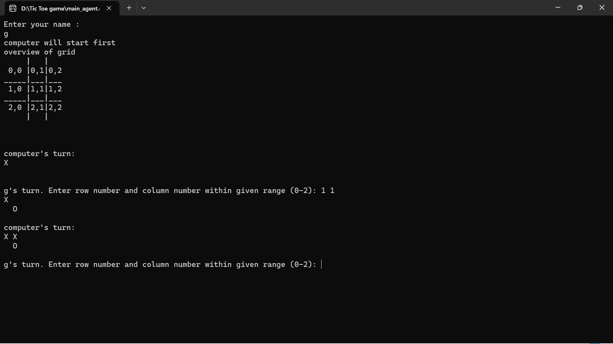

# Tic Tac Toe Game Agent with Minimax Algorithm



This project implements a Tic Tac Toe game agent using the Minimax algorithm. The Minimax algorithm is a decision-making algorithm commonly used in two-player games to determine the optimal move for a player.

## Features

- Play against a computer-based Tic Tac Toe game agent.
- The game agent uses the Minimax algorithm to make optimal moves.
- Interactive command-line interface for playing the game.

## How it Works

The Minimax algorithm is a recursive algorithm that explores all possible game states by simulating moves for both players. It assigns a score to each possible move and chooses the move with the highest score when it's the computer's turn or the move with the lowest score when it's the opponent's turn.

The algorithm uses the following steps:

1. If it's the computer's turn, loop through available moves, simulate each move, and call the Minimax function recursively for the opponent's turn.
2. If it's the opponent's turn, loop through available moves, simulate each move, and call the Minimax function recursively for the computer's turn.
3. Evaluate and return the best move with the highest score for the computer or the lowest score for the opponent.

## Getting Started

1. Clone this repository:

   ```sh
   git clone https://github.com/gauravai2025/tic-tac-toe-minimax.git
